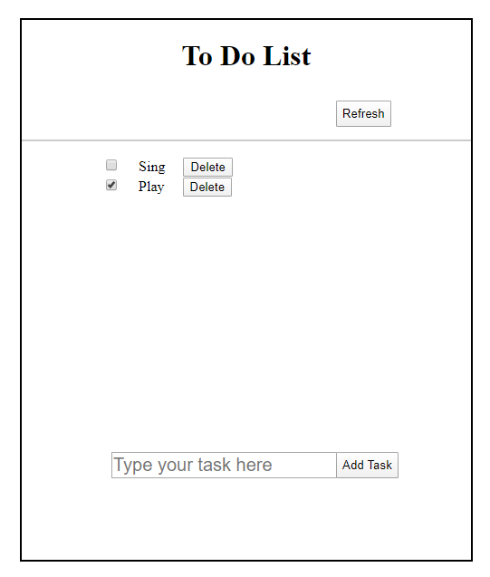

# todolistjs
A to do list created using JavaScript, HTML and CSS. 

Everytime you click on add task a new element is created and the task's content is shown at top.

The task has the delete button in the right side and the checkbox on the left.

After the completion of the task you can tick the checkbox or delete the task if its not necessary anymore.

You can use reset button to clear all the task and set new task for the day.

Demo: https://shovaaa.github.io/todolistjs/

